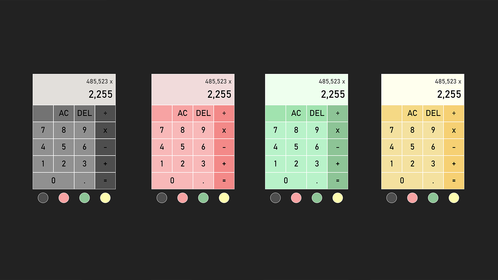

## 🧮 Simple Calculator
This is a modified code of [this](https://www.youtube.com/watch?v=j59qQ7YWLxw) tutorial. It is your standard everyday calculator. It is coded using [HTML](https://www.w3.org/html/), [CSS](https://www.w3schools.com/css/) and [Vanilla JavaScript](https://www.javascript.com/). You can also view a live demo of this project [here](https://zhon12345-calculator.netlify.app).

## 📃 Changes
* When users click on the blank square on the top left of the calculator, four circles will now appear below the calculator.
* When users click on the circle, the color theme of the calculator will change accordingly.

## 🖼️ Preview

