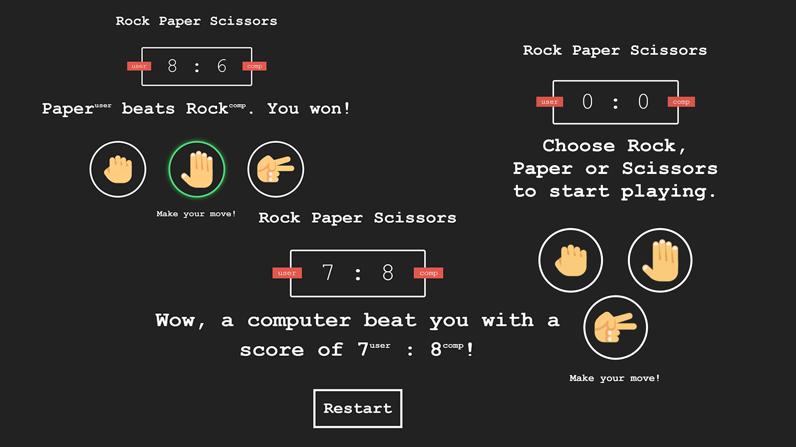

# 🗻📃✂ Rock Paper Scissors

This the classic Rock Paper Scissors game that you probably played as a kid. It is coded using [HTML](https://www.w3.org/html/), [CSS](https://www.w3schools.com/css/) and [Vanilla JavaScript](https://www.javascript.com/). Instead of playing with another user, you're playing against a computer. You can view a live demo of this project [here](https://zhon12345-rps.netlify.app).

## 📄 Changes
* Instead of going on forever, it is now a best out of 15 round game against the computer.
* When the user either wins or looses the 15 round battle, there is an option to restart the game and set the score back to `0 : 0` as shown in the [preview](https://github.com/zhon12345/Web-Projects/tree/Rock-Paper-Scissors#%EF%B8%8F-preview) below.

## 🖼️ Preview

