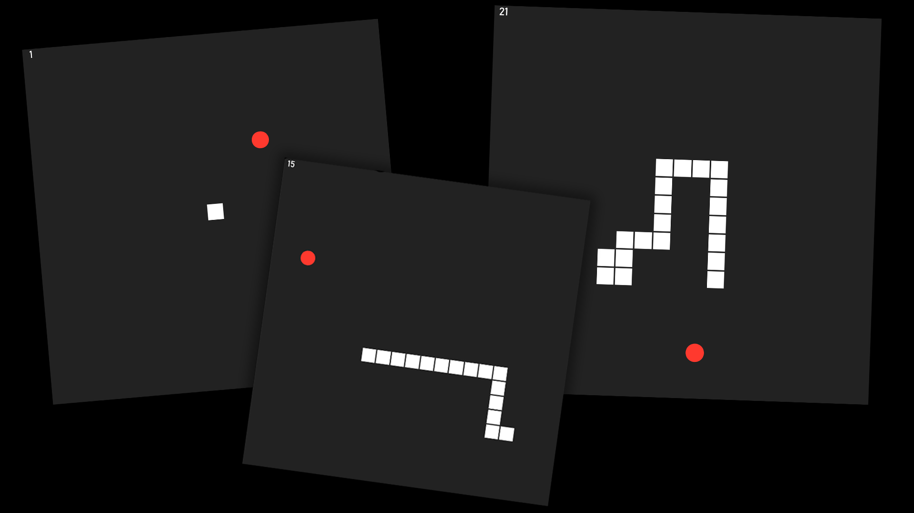

## 🐍 Snake Game
This is a modified code of [this](https://www.youtube.com/watch?v=QTcIXok9wNY) tutorial.   You can move the snake using the `WASD` keys or using the `Arrow Keys`.  It is coded using [HTML](https://www.w3.org/html/), [CSS](https://www.w3schools.com/css/) and [JavaScript](https://www.javascript.com/). You can view a live demo of this project [here](https://zhon12345-snake-game.netlify.app/).

## 📃 Changes
 * The overall color scheme is much easier on the eyes.
 * Added a counter on the top left that helps keep track of your score.
 * The food is now a red ball, which looks more like an apple.

## 🖼️ Preview

