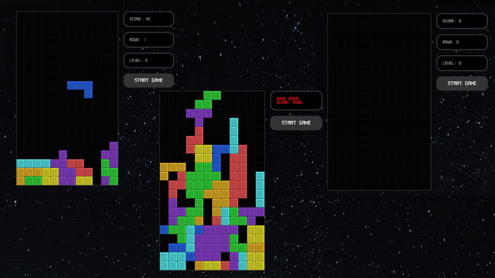

# Tetris Clone with React.js

This is a modified code of [this](https://www.youtube.com/watch?v=ZGOaCxX8HIU) tutorial. This Tetris clone is coded using [React.js](https://reactjs.org) and bootstrapped with [Create React App](https://github.com/facebook/create-react-app). You can view a live demo of this project [here](https://zhon12345-tetris.netlify.app).

## 📃 Changes
* Allowed users to move blocks with the `ASD` keys instead of the `ArrowLeft`, `ArrowDown` and `ArrowRight` only.
* Allowed users to rotate blocks using the `Q` and `E` keys instead of only `ArrowUp`. `Q` rotates the blocks clockwise and `E` rotates the blocks counter-clockwise.

## 🖼️ Preview
